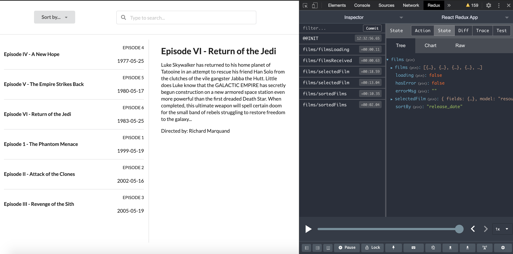

# Star Wars Movies

### Tools used

- React & Redux with Create React App Template.
- Redux Toolkit.
- Semantic UI.
- Styled component.

### Demo

See a live version of the project following this link [https://vibrant-bassi-3bcde6.netlify.app/](https://vibrant-bassi-3bcde6.netlify.app/)

## Available Scripts

In the project directory, you can run:

### `npm start`

Runs the app in the development mode. 
Open [http://localhost:3000](http://localhost:3000) to view it in the browser.

### Redux Store

